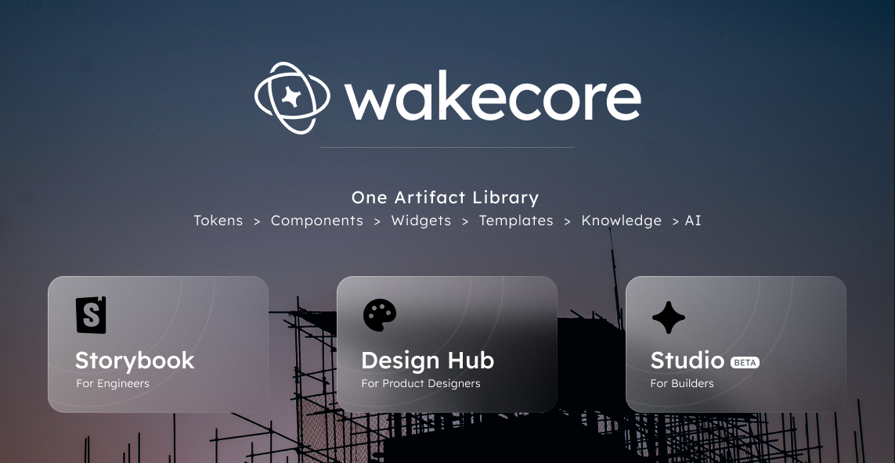

# WakeCore

**WakeCore is WakeCap's design system — but calling it a component library undersells it.**

It is a single **artifact library** (tokens → components → widgets → templates), a machine‑readable **knowledge layer** that explains how those artifacts should be used, and an **intelligence layer** that proves the knowledge actually helps — with **three products built on top of it**, one for engineers, one for designers, and one for anyone building software with AI.

The point of the whole system is one sentence: **you build *from* WakeCore, never from scratch** — and so does the AI.

Everything below is tagged by maturity and links to its evidence. The fastest overview of what's been measured is the **What we know now** summary in [`eval/EVIDENCE.md`](./eval/EVIDENCE.md).



Nothing exists only in Studio. Nothing exists only in Storybook. Nothing exists only in the Designers Hub. **Every product is a different view of the same source.**

---

## Contents

- [Why WakeCore exists](#why-wakecore-exists)
- [One source of truth](#one-source-of-truth)
- [Three products](#three-products)
- [Studio — building from WakeCore, never from scratch](#studio--building-from-wakecore-never-from-scratch)
  - [The golden rule](#the-golden-rule)
  - [The flywheel](#the-flywheel)
- [Architecture — three pillars](#architecture--three-pillars)
- [What we know now](#what-we-know-now)
- [Proven · Validated · In progress](#proven)
- [Packages](#packages)
- [Repository layout](#repository-layout)
- [Getting started](#getting-started)
- [Vision](#vision)

---

## Why WakeCore exists

AI assistance made UI cheap to generate and hard to keep coherent:

- Prototypes appeared quickly, but most couldn't be handed to engineering as‑is.
- The visual language drifted — every screen a slightly different version of "WakeCap".
- The decisions that make a UI correct — which component, when, how to compose a screen — lived in people's heads, not in the code.
- Agents could produce UI, but couldn't reliably follow WakeCap's patterns.

A component library alone doesn't solve this: it says *what exists*, not *what to build or why*. After studying Polar's [Orbit](https://polar.sh/blog/orbit-llm-safe-design-system) and working through how AI‑agent systems consume a design system, WakeCore grew a **knowledge layer** so those decisions travel with the code — for humans and agents alike.

The design was shaped by concrete engineering questions, which still frame the work:

- How do we *verify* that agents actually learn from the knowledge?
- Where does that knowledge live, and how do other agents reuse it?
- What would it take to *enforce* patterns without losing *enablement*?
- How do we show agents follow guidance instead of going off the rails?

WakeCore's answer is **measure first** — prove the knowledge helps before enforcing it.

## One source of truth

WakeCore is not a component library with some tools bolted on. It is a **single artifact library** that everything else reads from. Each tier is composed from the one below, and the top of the stack is knowledge an agent can act on:


This is the invariant the whole repository is organized around: **an artifact is authored once, and every surface — the engineer's Storybook page, the designer's pattern doc, the AI's generation step — is downstream of that single definition.** Change the artifact and every product moves with it. There is no second copy to keep in sync.

## Three products

Three audiences, three products, one library underneath.

### 1. Storybook — for engineers

**Audience:** Engineers. **Purpose:** component documentation and implementation.

[Storybook](./apps/storybook) is the visual browser for the artifact layer as engineers consume it — props, variants, states, real code. Its navigation mirrors the hierarchy — `Components/…`, `Widgets/…`, `Templates/…` (see [`docs/STORYBOOK-IA.md`](./docs/STORYBOOK-IA.md)) — and [Chromatic](./apps/storybook/LESSONS-LEARNED.md) runs visual‑regression on every story. Every artifact page also renders WakeCore's knowledge inline: a *Catalog knowledge* panel (from `library-index.json`) and, for widgets, a *Widget contract* panel (from the manifest). → [`ComponentKnowledge`](./apps/storybook/stories/_docs/ComponentKnowledge.tsx), [`WidgetManifestPanel`](./apps/storybook/stories/_docs/WidgetManifestPanel.tsx)

### 2. Designers Hub — for designers

**Audience:** Designers. **Purpose:** visual documentation, patterns, guidance, templates, widgets, and design knowledge.

The [Designers Hub](./apps/web) is the same artifacts seen through a designer's lens: theme tokens, component galleries, charts, maps, and full page templates, grouped exactly as the library is. It answers *what to reach for and how to compose it* — the visual counterpart to Storybook's implementation view, reading from the identical source.

### 3. Studio — for people building software

**Audience:** Anyone building software. **Purpose:** describe software, and build applications from WakeCore — never from scratch, always from WakeCore.

[Studio](./apps/studio) is the read‑only front door to WakeCore — browse and preview the library, then build from it in an AI editor. It's covered in depth in the next section.

> **The Hub.** These three run behind one shell — [`apps/hub`](./apps/hub), a single localhost with Studio, Storybook, and the Designers Hub side by side, so the library and its three views are one place, not three tabs to hunt for.

## Studio — building from WakeCore, never from scratch

Studio is the **third product**, and it is deliberately *not* another design tool — and not another AI chat. It is the **read‑only front door to WakeCore**: it browses and previews the canonical library, then hands off to an AI editor to build from it. Studio itself never edits, converses, or runs an agent. The intelligence — *deterministic template/widget resolution, validation, and PageInstance generation over the WakeCore catalog* — lives in [`@wakecap/sdk`](./packages/sdk) and is exposed to any AI editor through [`@wakecap/mcp`](./packages/mcp), the tool‑agnostic API that answers `resolve` / `validate` / `generate`.

The flow is preview → build → contribute:

**Preview.** Browse or search the official templates, open one, and see it rendered live by the WakeCore renderer — light or dark, at any screen size. Nothing is edited yet; Studio shows only approved WakeCore.

**Build with.** When you're ready, Studio launches a Claude Code session — in your browser (via Remote Control) or a terminal (VS Code included) — into an **isolated git worktree** of the repo. It opens already knowing the template, wired to the WakeCore MCP + SDK + skills and a reuse‑first brief, with a standalone preview of just that template running locally. You edit there; your changes stay on the session's branch and never touch the original.

**Contribute.** Edits reach Studio only through the normal flow — commit → PR → review → merge. Then the approved change appears in Studio's canonical view. The gap between "you edited it" and "Studio shows it" *is* the governance.

Either way, the answer is assembled from the library first, and code is a rendering of that assembly — not a fresh React project the AI improvised.

### The golden rule

**The AI never starts from an empty React project.** Before it writes anything, it asks one question:

> *Can WakeCore already solve this?*

and resolves the request in a fixed order — the exact resolution `@wakecap/sdk` performs over the catalog:

```
Templates   ── is there a page that already does this?
   ↓
Widgets     ── is there a composed block that already does this?
   ↓
Components   ── can it be assembled from primitives?
   ↓
Generate    ── last resort, and only for what's genuinely missing
```

Generation is the **last resort**, not the default. And every generated artifact is held to one standard: it should look and behave like WakeCore — so that later it can be **promoted into WakeCore itself** and stop being generated at all.

### The flywheel

Because generation is a last resort *and* generated artifacts can be promoted, WakeCore improves itself with use:

```
        Prompt
          │
          ▼
   Search WakeCore ───────────────┐
          │                       │
          ▼                       │
  Reuse existing artifacts        │  (most requests end here)
          │                       │
          ▼                       │
  Generate only if necessary      │
          │                       │
          ▼                       │
  Promote useful artifacts ───────┘
          │
          ▼
   WakeCore grows  →  future projects reuse them  →  fewer generations next time
```

The more it's used, the less it needs to generate — every promotion makes the next project start further ahead. Promotion is a real, gated path today (validated prototype → PR into the library), not an aspiration.

---

## Architecture — three pillars

The three products above are the *surfaces*. Underneath, WakeCore is built as three pillars that build on one another:

> **Artifacts** are authored. **Knowledge** explains them. **Intelligence** validates and improves the knowledge.
>
> Artifacts are *what you assemble*. Knowledge *tells* you what to build, when, and why. Intelligence *proves* the knowledge is right.

Each pillar lists what exists today and how mature it is.

### 1. Artifacts — *what you can assemble*

The hierarchy of reusable building blocks. Each tier is composed from the one below:

```
Tokens  →  Components  →  Widgets  →  Templates  →  Flows (future)
```

- **Tokens** — OKLCH colour/spacing/typography (light/dark), one source for every consumer. → [`@wakecap/core-tokens`](./packages/tokens)
- **Components** — generic UI primitives, no domain meaning (Button, Input, Card, Dialog). ~71 of the 118. → [`@wakecap/core-ui`](./packages/components)
- **Widgets** — composed, domain‑meaningful blocks with a data contract (DataTable, App Sidebar, Activity Log). ~30 logically promoted from the component set; `DataTable` is the first with a complete manifest. → [`docs/ARTIFACT-CLASSIFICATION.md`](./docs/ARTIFACT-CLASSIFICATION.md)
- **Templates** — page‑level compositions that own layout/regions (Login Page, Org/Project dashboards, Error Page). ~12, today the `pages/*` exports. → [`docs/ARTIFACT-CLASSIFICATION.md`](./docs/ARTIFACT-CLASSIFICATION.md)
- **Flows** — multi‑screen journeys. **Future**, not built.

Plus [`@wakecap/core-utils`](./packages/utils) for shared helpers.

**Browse them: [Storybook](./apps/storybook) is the visual browser for the artifact layer.** Its navigation mirrors the hierarchy — `Components/…`, `Widgets/…`, `Templates/…` (see [`docs/STORYBOOK-IA.md`](./docs/STORYBOOK-IA.md)) — and [Chromatic](./apps/storybook/LESSONS-LEARNED.md) runs visual‑regression on every story. Each tier has its own catalog: the **Component Catalog**, the **Widget Catalog**, and the **Template Catalog** (placeholder today), each a searchable index that links to the per‑artifact page.

- **Maturity:** Components **stable / shipped**. Widgets **logically promoted** — declared (`tier: "widget"`), grouped in Storybook, with manifests (one complete, the rest stubs); *no source moved, no export or API changed*. Templates **declared**; manifests planned. Flows **future**.

### 2. Knowledge — *what to build, when, and why*

Everything that teaches how artifacts should be used — **attached to the artifacts themselves**, and consumable identically by people and agents. This pillar absorbs both the old "Design Knowledge" and most of "Product Intelligence": product knowledge is simply another kind of knowledge attached to artifacts (templates and their manifests), not a separate layer.

- **Per‑artifact decision knowledge** — `intent` / `when` / `chooseOver` / `avoid` / `requires` / `pairsWith` / `variantIntent` / `tier`, in [`library-index.json`](./library-index.json).
- **Widget manifests** — the *build contract*: `dataContract` / `configSchema` / `states` / `composedOf` / `commonMistakes` / `evaluationCriteria` / `lineage`. [`manifests/data-table.widget.json`](./manifests/data-table.widget.json) is the complete reference; 29 others are honest stubs. → [`manifests/`](./manifests)
- **Template manifests** — page regions + composed widgets. **Planned.**
- **Composition patterns** (`patterns[]`) and a narrative [composition skill](./packages/components/skills/core-ui-composition/SKILL.md).
- **Failure modes** — 27 documented wrong/right fixes in [`domain_map.yaml`](./skills/_artifacts/domain_map.yaml).
- **Lineage / provenance** — each manifest records where its knowledge came from and how it was derived/verified.
- **Surfaced visually** — Storybook renders this knowledge on every artifact page: a *Catalog knowledge* panel (from `library-index.json`) and, for widgets, a *Widget contract* panel (from the manifest). → [`ComponentKnowledge`](./apps/storybook/stories/_docs/ComponentKnowledge.tsx), [`WidgetManifestPanel`](./apps/storybook/stories/_docs/WidgetManifestPanel.tsx)

Knowledge answers: **what** to build, **when**, **why**, **with what**, and **what not to do**. This is the layer `@wakecap/sdk` reads to resolve a request, and the layer Studio's golden rule is built on.

- **Maturity:** Component‑level decision knowledge **authored, and proven to improve agent output** (see *What we know now*). Widget manifests **in pilot** (1 complete, 29 stub). Template / product knowledge **in progress**.

### 3. Intelligence — *proving and improving the knowledge*

Everything that proves, validates, and improves the knowledge. The distinction that matters: **Knowledge tells; Intelligence proves.**

- **Evaluation framework** — an A0–A4 ablation ladder with a fair baseline and Wilson confidence intervals. → [`eval/ablation.mjs`](./eval/ablation.mjs)
- **Deterministic validators** — component‑choice, imports, provider‑wiring, failure‑mode, and the widget‑manifest checker. → [`scripts/validators/`](./scripts/validators)
- **Behavioral graders** — `tsc` compile against the real built types, plus render‑smoke. → [`eval/graders/`](./eval/graders)
- **A/B experiments** rigorous enough to **disprove their own assumptions** (they overturned an early "imports" claim and caught a grader bug).
- **The learning loop** — validators return actionable findings (`{reason, suggestedFix, source}`) an agent can correct against. → [`eval/AUDIT.md`](./eval/AUDIT.md)
- **Enforcement** — **future**; a check becomes a gate only once evidence shows it helps.

- **Maturity:** **Working as measurement; enforcement deliberately deferred** until evidence justifies it.

## What we know now

Findings from the evaluation work to date. One model (`claude-opus-4-8`); small samples, so results are directional unless a confidence interval is cited. Full detail and method: [`eval/EVIDENCE.md`](./eval/EVIDENCE.md).

| Finding | Status | Evidence |
|---|---|---|
| Composition knowledge reduces failure modes — **+73 pts (23% → 97%)**, CIs separated, p≪0.001 | **Proven** | [ablation](./eval/results/ablation.md) · [EVIDENCE](./eval/EVIDENCE.md) |
| Import/provider **conventions are not the differentiator** — a fair baseline already gets them right 100% of the time | **Proven (negative result)** | [EVIDENCE](./eval/EVIDENCE.md) |
| The framework can **disprove its own assumptions** — it overturned an early "imports" claim and caught a grader bug | **Proven** | [EVIDENCE](./eval/EVIDENCE.md) · [AUDIT](./eval/AUDIT.md) |
| Component selection improves — **+13 pts (83% → 97%)** | **Validated, not yet conclusive** (CIs overlap at k=3) | [ablation](./eval/results/ablation.md) |
| Generated code compiles — **~60%** (single component) / **~76%** (full knowledge) against real types | **Being measured** | [compile grader](./eval/graders/compile.mjs) |
| Full‑screen composition quality · runtime quality · accessibility · product‑workflow knowledge | **Not yet measured** | [V3 design](./eval/V3-DESIGN.md) |

## Proven

- **Shared knowledge system.** Design decisions captured in machine‑readable form — intent, selection rules, composition recipes, failure modes — consumable identically by people and agents. → [`library-index.json`](./library-index.json), [`skills/`](./packages/components/skills), [`domain_map.yaml`](./skills/_artifacts/domain_map.yaml)
- **Evaluation framework.** A repeatable A/B ablation that isolates each knowledge layer's effect with deterministic and behavioral graders plus confidence intervals — rigorous enough to disprove its own claims. → [`eval/ablation.mjs`](./eval/ablation.mjs), [`scripts/validators/`](./scripts/validators), [`eval/graders/`](./eval/graders)
- **Composition knowledge improves correctness.** The single largest measured effect (+73 pts; see *What we know now*).

## Validated, still expanding

- **Component‑selection intelligence.** Semantic guidance improves which component an agent picks (+13 pts), but the signal isn't yet statistically conclusive — it needs more repetitions and harder cases where the obvious choice is wrong. → [`eval/V3-DESIGN.md`](./eval/V3-DESIGN.md)
- **Artifact tiers.** The widget/template hierarchy is real, not theoretical: 30 widgets promoted with manifests and grouped in Storybook, 12 templates declared — a logical promotion that broke no imports, exports, or APIs. `DataTable` is the first widget with a complete, validated manifest. → [`docs/ARTIFACT-CLASSIFICATION.md`](./docs/ARTIFACT-CLASSIFICATION.md), [`manifests/`](./manifests)
- **Agent learning loop.** Validators return actionable findings (`{reason, suggestedFix, source}`) an agent can correct against; automated self‑correction is being expanded. → [`scripts/validators/`](./scripts/validators), [`eval/AUDIT.md`](./eval/AUDIT.md)

## In progress

- **Product knowledge.** Encoding how WakeCap products are structured — dashboards, analytics, monitoring, admin tools, multi‑step journeys — as templates and template manifests. → [`eval/V3-DESIGN.md`](./eval/V3-DESIGN.md)
- **Manifest maturity.** Hardening the 29 widget‑manifest stubs into complete contracts (next: `core-app-sidebar`), and designing the template‑manifest schema. → [`manifests/`](./manifests), [`docs/ARTIFACT-CLASSIFICATION.md`](./docs/ARTIFACT-CLASSIFICATION.md)
- **Behavioral validation.** Compile (`tsc`) and render‑smoke run as first‑class metrics; render‑smoke is a server‑render floor today, and accessibility (axe) plus full browser/runtime checks are not yet built. → [`eval/graders/`](./eval/graders)
- **Enforcement.** A check is promoted from measurement to a gate only once evidence shows it helps. Nothing is enforced today.

## Packages

Five installable packages: the artifact library and its consumers, plus the SDK and MCP server that let AI build from it.

| Package | What it is |
|---|---|
| [`@wakecap/core-ui`](./packages/components) | 118 React artifacts — generic components, composed widgets, and page templates, classified by responsibility in [`docs/ARTIFACT-CLASSIFICATION.md`](./docs/ARTIFACT-CLASSIFICATION.md) |
| [`@wakecap/core-tokens`](./packages/tokens) | OKLCH design tokens (light/dark); presets for Tailwind 4, Tailwind 3, or no Tailwind |
| [`@wakecap/core-utils`](./packages/utils) | small shared helpers (`cn()`, etc.) |
| [`@wakecap/sdk`](./packages/sdk) | deterministic template/widget resolution, validation, and PageInstance generation over the WakeCore catalog — the engine behind Studio's golden rule |
| [`@wakecap/mcp`](./packages/mcp) | the tool‑agnostic intelligence API any AI editor consults to build UI from WakeCore (`resolve` / `validate` / `generate`); wraps `@wakecap/sdk` over stdio |

On top of the artifacts sits a machine‑readable **knowledge layer** (`library-index.json`, widget/template manifests, loadable skills, a failure‑mode catalog) and an **intelligence layer** — the evaluation framework that measures whether that knowledge actually changes what an agent builds.

## Repository layout

```
packages/
  components/   @wakecap/core-ui       artifact library (components → widgets → templates)
  tokens/       @wakecap/core-tokens   OKLCH tokens + Tailwind 3/4/no‑Tailwind presets
  utils/        @wakecap/core-utils    shared helpers
  sdk/          @wakecap/sdk           catalog resolution / validation / PageInstance generation
  mcp/          @wakecap/mcp           MCP server exposing the SDK to AI editors
apps/
  storybook/    Storybook              engineers — component docs + implementation
  web/          Designers Hub          designers — visual docs, patterns, templates, knowledge
  studio/       Studio                 builders — read-only browser + preview; launches AI editing from WakeCore
  hub/          Hub                    one shell that unifies Studio + Storybook + Designers Hub
  composer/     Composer               visual page editor (Puck) over the artifact library
library-index.json                     per‑artifact decision knowledge (intent/when/avoid/…)
manifests/                             widget/template build contracts
skills/                                loadable agent skills + failure‑mode catalog
eval/                                  intelligence layer — ablation ladder, graders, evidence
scripts/                               validators + catalog/manifest generation
docs/                                  artifact classification, Storybook IA, design decisions
playground/                            TW3 / TW4 consumer test apps
```

The knowledge and intelligence layers are first‑class directories, not afterthoughts: `library-index.json` and `manifests/` *are* the knowledge; `eval/` *is* the proof.

## Getting started

WakeCore is a pnpm + Nx monorepo (see [`CLAUDE.md`](./CLAUDE.md) for the full toolchain — Oxlint, Oxfmt, TypeScript 5.9, React, Tailwind 4, Vitest + Chromatic).

```bash
pnpm install          # install; also loads the agent skills (postinstall)

pnpm storybook        # Storybook — the engineer's view          (apps/storybook)
pnpm dev              # Designers Hub — the designer's view       (apps/web)
pnpm studio           # Studio — browse + preview, build with AI    (apps/studio)
pnpm hub              # the Hub — all three behind one localhost  (apps/hub)
```

Working on the library or its knowledge:

```bash
pnpm build            # build every @wakecap/core-* package
pnpm typecheck        # tsc across the workspace
pnpm test             # Vitest (browser mode)
pnpm eval             # run the intelligence layer's ablation
pnpm validate:manifests   # check widget/template manifests
pnpm generate:catalog     # regenerate library-index.json from source
```

## Vision

**Knowledge → Measurement → Validation → Enforcement.** WakeCore aims to be where WakeCap's design decisions live — a single artifact library where **artifacts are authored, knowledge explains them, and intelligence continuously validates and improves them** — surfaced through three products for engineers, designers, and builders, and demonstrably helping both people and AI build correct, on‑brand UIs **from WakeCore, never from scratch**, with every step toward enforcement backed by evidence rather than assertion.
